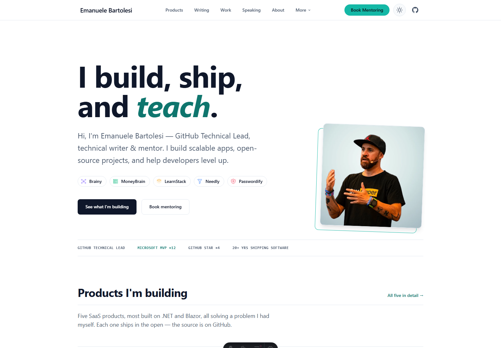
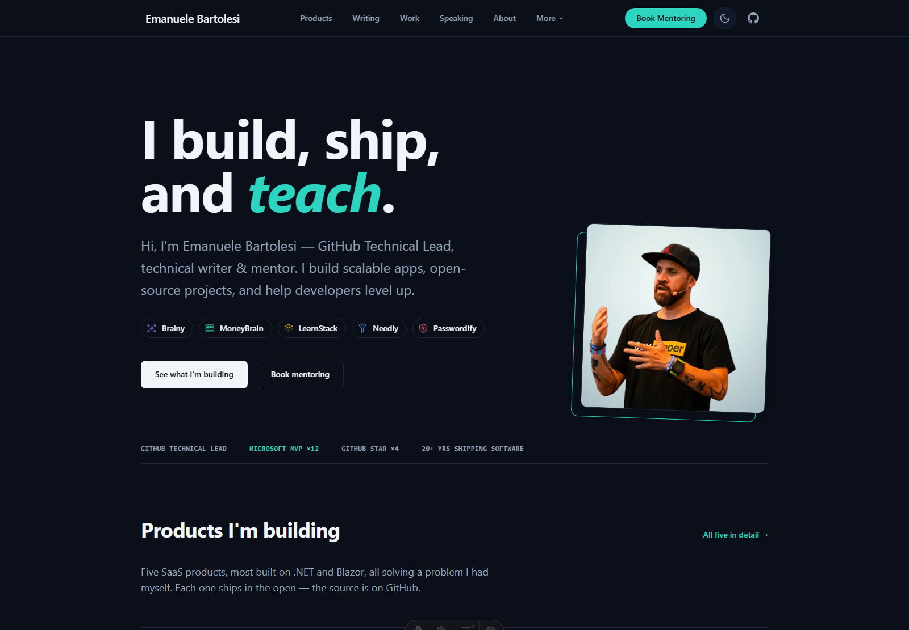
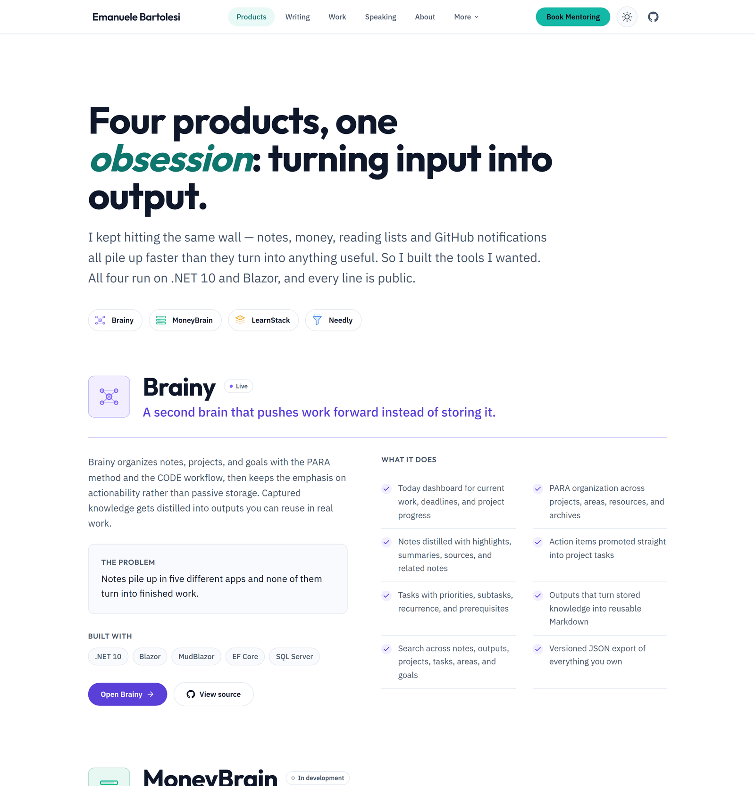
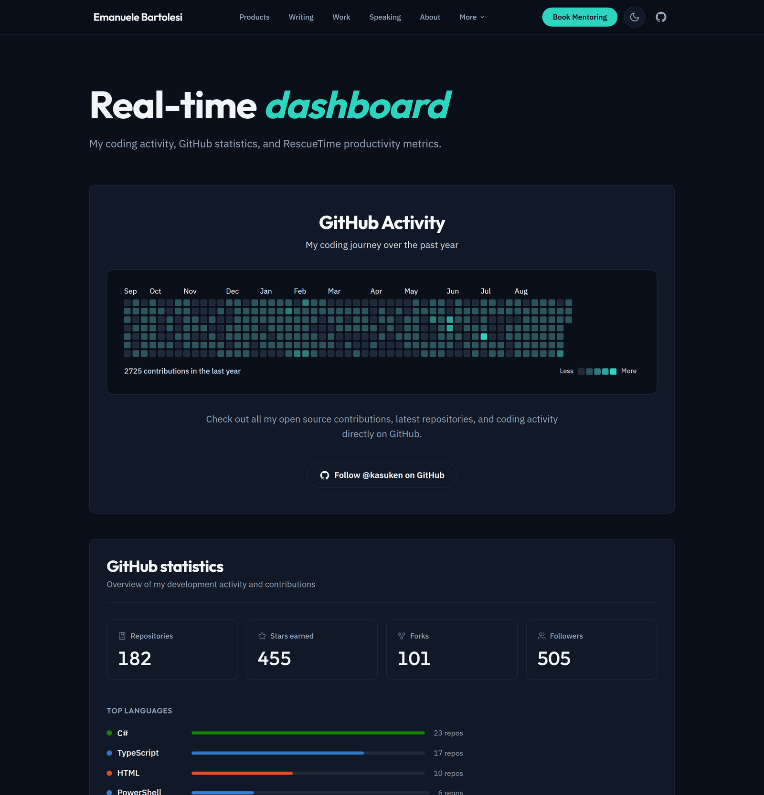

# 🚀 Emanuele Bartolesi's Website

[](https://astro.build/)
[](https://web.dev/measure/)
[](https://www.typescriptlang.org/)
[](https://aws.amazon.com/amplify/)

A fast, modern, SEO-optimized personal site — home to four SaaS products, a public revenue journey, writing, speaking, and mentoring. Built with Astro, a token-driven design system, and a measured accessibility floor.

## 📸 Screenshots

### Homepage

| Light | Dark |
| --- | --- |
|  |  |

### Products — Brainy, MoneyBrain, LearnStack & Needly



### Real-time dashboard



## ✨ Key Features

### 🧩 **SaaS Product Showcase**
- **Four products** — Brainy, MoneyBrain, LearnStack and Needly, each with its own brand hue
- **Per-product theming** — set `data-product="<slug>"` on any ancestor and descendants inherit that product's colour tokens
- **Authored product marks** — geometric SVG built on one 48×48 grid, no stock icons
- **Structured data** — `SoftwareApplication` JSON-LD per product

### 🎨 **Design System**
- **Token-driven theming** — every colour, type step and radius is a CSS custom property
- **Light & dark themes** — system preference detection with a manual override, no flash on load
- **Measured contrast** — key pages pass WCAG AA in both themes, verified with an automated audit
- **Drawn icon system** — [Lucide](https://lucide.dev) glyphs inlined at build time on one 24×24 grid; no emoji as icons
- **One authored entrance** — scroll reveal that is opt-in before first paint and skipped under `prefers-reduced-motion`
- See **[DESIGN.md](DESIGN.md)** for the tokens, the rules behind them, and the standing bans

### 🎯 **Performance & SEO**
- **SEO optimized** — canonical URLs, OpenGraph, structured data, sitemap and RSS feed
- **Accessibility** — semantic HTML, ARIA labels, visible focus rings, themed browser surfaces
- **Progressive enhancement** — content renders without JavaScript; motion and reveals layer on top

### 📚 **Content**
- **Dynamic blog** — automatic synchronization with Dev.to articles
- **Books showcase** — published and upcoming titles with purchase links
- **Portfolio projects** — open-source work and tools
- **Course catalog** — training programs and workshops
- **Speaking engagements** — live Sessionize integration for upcoming and past talks
- **The Million Journey** — a public revenue tracker toward $1,000,000
- **Real-time dashboard** — live GitHub statistics, contribution calendar and RescueTime productivity metrics

### 📈 **Analytics**
- **[Microsoft Clarity](https://clarity.microsoft.com/)** — heatmaps and session replay, loaded in production builds only so local development never lands in the recordings

## 🏗️ Architecture & Tech Stack

### **Frontend**
- **[Astro](https://astro.build/)** — static site generator with islands architecture
- **[TypeScript](https://www.typescriptlang.org/)** — type safety across the codebase
- **[Tailwind CSS v4](https://tailwindcss.com/)** — utility layer on top of the CSS custom-property token system
- **[MDX](https://mdxjs.com/)** — configured and available for rich content

### **Typography**
| Role | Face |
| --- | --- |
| Display | Outfit |
| Body | IBM Plex Sans |
| Data & measurement | JetBrains Mono |

### **Integrations & APIs**
- **[Dev.to API](https://developers.forem.com/api)** — blog post synchronization
- **[Sessionize API](https://sessionize.com/)** — speaking engagements
- **[GitHub API](https://docs.github.com/en/rest)** — repository statistics and language breakdown
- **[RescueTime API](https://www.rescuetime.com/)** — productivity tracking
- **[Microsoft Clarity](https://clarity.microsoft.com/)** — behavioural analytics

### **Deployment**
- **[AWS Amplify](https://aws.amazon.com/amplify/)** — serverless deployment with CI/CD
- **Server-side rendering** in production via the Astro Amplify adapter; static output locally
- **Edge distribution** — global CDN

## 📁 Project Structure

```
📦 website/
├── 🤖 .agents/skills/impeccable/  # Vendored design skill (see "Design workflow")
│
├── 🎨 public/
│   └── 🖼️  img/                    # Images and graphics
│
├── 📸 docs/screenshots/           # README screenshots
│
├── 📂 src/
│   ├── 🧩 components/             # Reusable UI components
│   │   ├── BaseHead.astro         # SEO, meta tags, theme bootstrap, analytics
│   │   ├── Header.astro           # Navigation
│   │   ├── Footer.astro           # Site footer
│   │   ├── Icon.astro             # Lucide-backed icon system
│   │   ├── ProductMark.astro      # Geometric mark per SaaS product
│   │   ├── ProductShowcase.astro  # Homepage product ledger
│   │   ├── ThemeToggle.astro      # Light/dark toggle
│   │   ├── GitHubStats.astro      # Live GitHub statistics
│   │   ├── GitHubActivityCalendar.astro
│   │   ├── RescueTimeProductivity.astro
│   │   └── TheMillionJourney.astro
│   │
│   ├── 📊 data/                   # Content data and configuration
│   │   ├── products.ts            # The four SaaS products
│   │   ├── books.ts               # Books and publications
│   │   ├── courses.ts             # Training courses
│   │   ├── projects.ts            # Portfolio projects
│   │   └── uses.ts                # Tools and hardware
│   │
│   ├── 🎯 layouts/                # Page layouts
│   ├── 📚 lib/                    # API loaders (Dev.to, RescueTime)
│   │
│   ├── 📄 pages/                  # Routes
│   │   ├── index.astro            # Homepage
│   │   ├── products.astro         # SaaS products
│   │   ├── blog/                  # Blog index and posts
│   │   ├── portfolio.astro        # Open-source projects
│   │   ├── speaking.astro         # Talks (Sessionize)
│   │   ├── activities.astro       # Real-time dashboard
│   │   ├── millionjourney.astro   # Public revenue tracker
│   │   ├── books.astro, courses.astro, uses.astro
│   │   ├── about.astro, mentor.astro, live.astro, newsletter.astro
│   │   └── rss.xml.js             # RSS feed
│   │
│   ├── 🎨 styles/global.css       # Design tokens and base styles
│   └── ⚙️  consts.ts               # Site configuration
│
├── 📋 scripts/refresh-blog.mjs    # Blog content refresh
├── 🎨 DESIGN.md                   # Design system documentation
├── ⚙️  astro.config.mjs
├── 📦 package.json
└── 📖 README.md
```

## 🚀 Quick Start

### Prerequisites
- **Node.js v22 or higher** (enforced via `engines` in `package.json`)
- **npm**

### Installation

1. **Clone the repository**
   ```bash
   git clone https://github.com/kasuken/website.git
   cd website
   ```

2. **Install dependencies**
   ```bash
   npm install
   ```

3. **Set up environment variables**
   ```bash
   cp .env.example .env
   ```

   All keys are **optional** — the site builds and runs without them, falling back to placeholder content for the integrations that are missing:
   ```env
   # Dev.to integration — blog posts
   DEVTO_API_KEY=your_devto_api_key

   # RescueTime integration — productivity metrics
   RESCUETIME_API_KEY=your_rescuetime_api_key

   # GitHub API — raises the rate limit for repository statistics
   GITHUB_TOKEN=your_github_token
   ```

4. **Start development server**
   ```bash
   npm run dev
   ```

5. **Open your browser** and visit `http://localhost:4321`

## 📜 Available Scripts

| Script | Description |
|--------|-------------|
| `npm run dev` | Start development server with hot reload |
| `npm run build` | Build for production |
| `npm run preview` | Preview production build locally |
| `npm run astro` | Run Astro CLI commands |
| `npm run refresh-blog` | Sync blog posts from Dev.to |

## 🌟 Key Pages

### 🏠 **Homepage** (`/`)
Hero naming the four SaaS products, a product ledger, editorial links to the rest of the site, and the latest blog posts.

### 🧩 **Products** (`/products`)
The four SaaS products in detail — what each does, the problem it solves, its capabilities and stack — plus a comparison table for choosing between them.

### 📝 **Blog** (`/blog`)
Articles synchronized from Dev.to, with reading time, reactions and an RSS feed.

### 💼 **Portfolio** (`/portfolio`)
Open-source projects and tools, with links to live demos and repositories.

### 🎤 **Speaking** (`/speaking`)
Live Sessionize integration: upcoming events, past events, extracted topics, and the session catalog.

### 📊 **Activities** (`/activities`)
Real-time dashboard — GitHub statistics, a contribution calendar, and RescueTime productivity metrics.

### 💸 **The Million Journey** (`/millionjourney`)
A public tracker toward $1,000,000 in revenue. Each square represents $1,000, coloured by income stream, with a milestone timeline and a category breakdown.

### 📚 **Books** (`/books`) · 🎓 **Courses** (`/courses`) · 🛠 **Uses** (`/uses`)
Published and upcoming books with purchase links, the training catalog, and the hardware and software behind the work.

### 👨‍🏫 **Mentoring** (`/mentor`)
Mentoring approach, areas of expertise, and booking information.

## 🎨 Design Workflow

The design system is documented in **[DESIGN.md](DESIGN.md)** — tokens, the reasoning behind them, and the patterns that stay out of the codebase.

This repository vendors the [impeccable](https://github.com/pbakaus/impeccable) design skill under `.agents/skills/impeccable/`, so the design rules travel with the code. To restore the agent symlinks on a fresh clone:

```bash
npx skills install
```

## 🔧 Customization Guide

### **Design tokens**

Tokens live in `src/styles/global.css`. Two rules matter most:

```css
:root {
  --accent: var(--color-accent-500);   /* fills: buttons, marks, bars */
  --accent-text: var(--color-accent-700); /* accent as TEXT — the deeper shade */
  --on-accent: #0b0f19;                /* ink that sits on an accent fill */
}
```

- **Fill and text are different shades.** Teal-500 on white is 2.49:1 and fails AA, so it may never be a text colour — use `--accent-text`.
- **Filled controls declare their own ink.** Use `--on-accent` (or `--p-on` for a product) rather than `white`, which flips legibility between themes.

### **Product theming**

Each product owns a hue. Put `data-product="<slug>"` on any ancestor and descendants inherit `--p` (graphics), `--p-ink` (text), `--p-tint` (surfaces), `--p-edge` (borders) and the `--p-solid` / `--p-on` button pair:

```astro
<article data-product="brainy">
  <h3 class="text-[var(--p-ink)]">Brainy</h3>
</article>
```

### **Icons**

Icons come from Lucide, inlined at build time. To add one, import its raw SVG in `src/components/Icon.astro` and register it in `GLYPHS`:

```astro
import rocket from 'lucide-static/icons/rocket.svg?raw';
// then add `rocket,` to the GLYPHS map
<Icon name="rocket" class="w-5 h-5" />
```

### **Adding a product**

```typescript
// src/data/products.ts
{
  slug: 'needly',
  name: 'Needly',
  tagline: 'The action inbox for GitHub.',
  summary: '...',
  problem: '...',
  status: 'In development',   // or 'Live'
  site: 'https://needly.today',
  repo: 'https://github.com/kasuken/Needly',
  features: ['...'],
  stack: ['.NET 10', 'Blazor Web App'],
  bestFor: '...',
}
```

Then add the matching hue in `global.css` (`[data-product="needly"]`) and a mark in `ProductMark.astro`.

### **Adding a book or project**

```typescript
// src/data/books.ts
{
  id: 'your-book-id',
  title: 'Your Book Title',
  description: 'Brief description',
  publisher: 'Publisher Name',
  category: 'programming',   // or 'cloud', 'career', ...
  status: 'published',       // or 'writing', 'planning'
  purchaseLinks: { amazon: 'https://...', packt: 'https://...' },
}
```

```typescript
// src/data/projects.ts
{
  id: 'project-id',
  title: 'Project Name',
  description: 'Project description',
  category: 'web-app',       // or 'library', 'tool', ...
  technologies: ['React', 'TypeScript'],
  githubUrl: 'https://github.com/...',
  liveUrl: 'https://demo.example.com',
}
```

## 🚀 Deployment

### **AWS Amplify (current)**

1. **Connect the repository** to AWS Amplify
2. **Set environment variables** in the Amplify console
3. **Deploy automatically** on every push to `main`

The site uses the Astro AWS Amplify adapter for server-side rendering in production, and builds static output locally.

### **Other platforms**

Also deployable to Netlify, Vercel, Cloudflare Pages or any Node host — swap the adapter in `astro.config.mjs`.

## 🧪 Quality Checks

- **Contrast audit** — key pages are checked against WCAG AA in both light and dark themes
- **Responsive verification** — desktop and mobile breakpoints, checked for horizontal overflow
- **Design detector** — the impeccable skill's mechanical scan over changed UI files
- **TypeScript compilation** — type safety validation
- **Lighthouse audits** — performance, SEO and accessibility

## 📄 License

This project is licensed under the MIT License - see the [LICENSE](LICENSE) file for details.

---

*Built with ❤️ and lots of 🍵 by [Emanuele Bartolesi](https://github.com/kasuken)*
